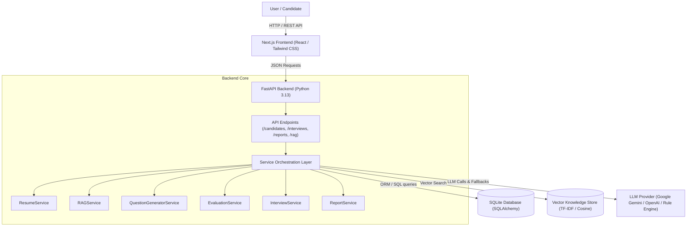

# IntervueAI

IntervueAI is a production-grade, AI-powered role-based technical interview platform that delivers context-grounded candidate evaluations. By combining candidate resume intelligence, RAG (Retrieval-Augmented Generation) knowledge retrieval, interactive answer evaluation, and deterministic difficulty scaling, IntervueAI generates personalized, non-generic technical questions anchored in real-world specifications and synthesizes traceable hiring reports.

---

## Problem

Traditional technical interviews often suffer from three core limitations:
1. **Generic, Ungrounded Questions**: Questions are frequently pulled from static question banks or generic LLM prompts ("What is a database?"), failing to test applied architectural depth or specific technical specifications.
2. **Disconnected from Candidate Experience**: Standard interviews do not adapt to a candidate's specific background, past project stack, or identified skill gaps.
3. **Random or Inconsistent Scoring**: IntervueAI eliminates arbitrary difficulty jumps and subjective evaluation by enforcing deterministic performance adaptation ($\ge 8.0$ promotes level, $< 5.5$ demotes level) and providing auditable lineage linking Knowledge Context → Question → Answer → Evaluation.

---

## Features

- **Resume Intelligence & Extraction**: Parses candidate PDF or plain text resumes using PyMuPDF (`fitz`), automatically extracting programming languages, frameworks, tools, domain competencies, experience indicators, and skill gaps without data fabrication.
- **Role-Aligned Evaluation**: Tailors question focus and depth across engineering roles (`AI/ML Engineer`, `Backend Engineer`, `Frontend Engineer`, `Fullstack Engineer`, `DevOps/SRE`).
- **Context-Grounded RAG Pipeline**: Ingests technical specs and reference material, performing semantic vector search to ground every generated question directly in retrieved document chunks.
- **Interactive 10-Step Interview Engine**: Supports the full interview lifecycle: `START → QUESTION → ANSWER → EVALUATION → NEXT QUESTION → COMPLETE`.
- **EvaluationService & Deterministic Difficulty**: Evaluates technical correctness, depth, clarity, strengths, missing concepts, and feedback. Automatically adapts difficulty (`Junior → Intermediate → Senior → Principal`) based on performance score thresholds.
- **Traceable Hiring Reports**: Synthesizes executive summaries, 4 core category scores (`fundamentals`, `applied knowledge`, `problem solving`, `resume/project understanding`), actionable hiring recommendations, and question-by-question lineage audits.
- **Production-Grade Resilience**: Features centralized JSON error handling (`{"error": ...}`), duplicate submission rejection (`409 Conflict`), secret/API key redaction, and graceful fallback to offline rule engines.
- **Sleek SaaS UI & Dashboard**: Next.js 14 frontend with an analytics dashboard, live audio/video controls, code template insertion, real-time keyword detection, and PDF report printing.

---

## Architecture

The system follows a decoupled service architecture:



---

## End-to-End Flow

The complete candidate interview journey follows a 9-stage pipeline:

```text
Resume Upload 
  ↓
Profile Extraction (Skills, Experience, Skill Gaps)
  ↓
Dynamic Query Formulation (Role + Topic + Candidate Profile)
  ↓
Vector RAG Retrieval (Top-K Semantic Chunks)
  ↓
Context Grounding (Injecting Specs into LLM Prompt)
  ↓
Question Generation & Validation (Grounding Check & Similarity < 0.65)
  ↓
Answer Submission (Candidate Explanation & Code Snippet)
  ↓
Structured Evaluation (Correctness, Depth, Clarity, Missing Concepts)
  ↓
Final Traceable Report (Scores, Recommendations, RAG Lineage Audit)
```

---

## RAG Architecture

The Retrieval-Augmented Generation (RAG) system guarantees that questions are technically meaningful and non-hallucinated:

1. **Document Ingestion**: Reads reference specifications and technical guides from the `knowledge-base/` directory.
2. **Chunking**: Splits documents along paragraph and section boundaries while preserving document titles, role categories, and chunk metadata with overlap.
3. **Embeddings & Vector Storage**: Computes dense term frequency and vector representations, persisting the vector index to `vector_store.json`.
4. **Retrieval**: Performs semantic cosine similarity search given a dynamic query, filtering by target engineering role and ranking top-K chunks.
5. **Grounded Generation**: Injects retrieved context text directly into the generation prompt. Validates candidate questions against grounding term overlap, rejects generic templates, and verifies similarity $< 0.65$ against prior session questions.

---

## Tech Stack

- **Frontend**: Next.js 14 (App Router), React 18, TypeScript, Tailwind CSS, Lucide React, Axios, Jest, React Testing Library.
- **Backend**: Python 3.13, FastAPI, Pydantic v2, SQLAlchemy (with automatic column synonym mapping).
- **Database**: SQLite (`intervue_ai.db`).
- **Vector Database**: Persistent JSON Vector Store (`vector_store.json`) with TF-IDF & Cosine Similarity search.
- **AI/ML & Utilities**: Google Generative AI (`gemini-1.5-flash`), OpenAI API (`gpt-4o-mini`), PyMuPDF (`fitz`), Rule-based Fallback Engines.

---

## Project Structure

```text
Rag/
├── backend/
│   ├── app/
│   │   ├── api/
│   │   │   ├── endpoints/       # API routers (candidates, interviews, rag, reports)
│   │   │   └── router.py
│   │   ├── core/
│   │   │   ├── config.py        # Settings & secret redaction utilities
│   │   │   └── database.py      # Database initialization & column migrations
│   │   ├── models/
│   │   │   └── domain.py        # SQLAlchemy domain models (Candidate, Session, Question, Answer, Evaluation, Report)
│   │   ├── schemas/
│   │   │   └── pydantic_schemas.py # Pydantic DTOs & response contracts
│   │   ├── services/
│   │   │   ├── resume_service.py
│   │   │   ├── rag_service.py
│   │   │   ├── question_generator.py
│   │   │   ├── evaluation_service.py
│   │   │   ├── interview_service.py
│   │   │   └── report_service.py
│   │   └── main.py              # FastAPI application entrypoint & exception handlers
│   ├── tests/                   # Pytest automated test suite (24 unit tests)
│   └── venv/                    # Python virtual environment
├── frontend/
│   ├── src/
│   │   ├── app/                 # Next.js pages (/, /setup, /interview/[id], /dashboard, /report/[id])
│   │   ├── components/          # Reusable UI components (Button, Card, Badge, Progress, Skeleton)
│   │   ├── lib/                 # Axios API client & TypeScript interfaces
│   │   └── __tests__/           # Jest & React Testing Library test suite
│   ├── package.json
│   ├── jest.config.js
│   └── tailwind.config.js
├── knowledge-base/              # Reference technical documentation for RAG grounding
├── scripts/
│   └── verify_system.py         # End-to-end system verification script
└── README.md
```

---

## Setup

### Prerequisites
- Python 3.11+
- Node.js 18+ & npm

### Installation Commands

```bash
# 1. Clone the repository
git clone https://github.com/your-org/intervue-ai.git
cd intervue-ai

# 2. Setup Python virtual environment
python3 -m venv backend/venv
source backend/venv/bin/activate
pip install -r backend/requirements.txt

# 3. Setup Frontend dependencies
cd frontend
npm install
cd ..
```

---

## Environment Variables

Configure backend settings via `.env` file in the project root or backend directory:

```env
ENVIRONMENT=development
LOG_LEVEL=INFO
DATABASE_URL=sqlite:///intervue_ai.db

# LLM Provider Configuration
LLM_PROVIDER=gemini       # Options: "gemini" | "openai"
GEMINI_API_KEY=your_gemini_api_key_here
OPENAI_API_KEY=your_openai_api_key_here

# Directory Paths
KNOWLEDGE_BASE_DIR=knowledge-base
VECTOR_STORE_PATH=vector_store.json

# Server Config
PORT=8000
HOST=0.0.0.0
CORS_ORIGINS=http://localhost:3000,http://127.0.0.1:3000
NEXT_PUBLIC_API_URL=http://localhost:8000/api
```

---

## Running Locally

### 1. Database Initialization
```bash
PYTHONPATH=backend backend/venv/bin/python -c "from app.core.database import init_db; init_db()"
```

### 2. Knowledge Base Ingestion
```bash
PYTHONPATH=backend backend/venv/bin/python -c "from app.core.database import SessionLocal; from app.services.rag_service import RAGService; RAGService.ingest_documents(SessionLocal(), force_reindex=True)"
```

### 3. Start Backend Server (FastAPI)
```bash
PYTHONPATH=backend backend/venv/bin/uvicorn app.main:app --host 0.0.0.0 --port 8000 --reload
```

### 4. Start Frontend Server (Next.js)
```bash
npm --prefix frontend run dev
```

The frontend will be accessible at `http://localhost:3000` and the API interactive docs at `http://localhost:8000/docs`.

---

## API Endpoints

| Method | Endpoint | Description |
| :--- | :--- | :--- |
| `POST` | `/api/candidates/` | Create candidate profile from text/JSON payload |
| `POST` | `/api/candidates/upload` | Upload resume PDF/TXT file and extract profile |
| `GET` | `/api/candidates/{id}` | Retrieve candidate profile details |
| `POST` | `/api/interviews/` | Initialize new interview session & generate Q1 |
| `GET` | `/api/interviews/{id}` | Fetch current interview session state & question |
| `POST` | `/api/interviews/answers/submit` | Submit candidate answer, evaluate & fetch next question |
| `GET` | `/api/interviews/{id}/report` | Retrieve final traceable interview report |
| `POST` | `/api/rag/ingest` | Trigger knowledge base document ingestion |
| `GET` | `/api/rag/search` | Perform semantic vector search over knowledge base |

---

## Design Decisions

- **Why FastAPI**: Provides asynchronous execution, auto-generated OpenAPI schemas, strict request validation via Pydantic, and fast performance.
- **Why Service Architecture**: Decouples business logic into single-responsibility services (`ResumeService`, `RAGService`, `QuestionGeneratorService`, `EvaluationService`, `InterviewService`, `ReportService`), making code testable, maintainable, and modular.
- **Why Vector Database**: Ensures zero hallucinated questions by forcing LLM generation to ground strictly in retrieved technical document chunks.
- **Chunking Strategy**: Splits text along natural paragraph boundaries while attaching document titles and role categories, ensuring high semantic density.
- **Resume-Aware Retrieval**: Dynamically incorporates candidate skills and identified skill gaps into vector search queries to probe growth areas.
- **Adaptive Questioning**: Implements deterministic difficulty adjustment based on performance thresholds ($\ge 8.0$ promotes, $< 5.5$ demotes), eliminating erratic difficulty jumps.

---

## Error Handling & Production Readiness

- **Centralized Error Responses**: All API exceptions return a uniform JSON structure: `{"error": {"code": status, "message": detail, "timestamp": ...}}`.
- **Secret Redaction**: `sanitize_secret_text` masks API keys (`AIzaSy...`, `sk-...`) in log outputs and error traces.
- **Duplicate Submission Rejection**: Submitting duplicate answers to an already-answered question raises `409 Conflict`.
- **Corrupted File Safety**: Validates PDF `%PDF-` file headers to reject corrupted files with clear user feedback.
- **Graceful AI Fallback**: Seamlessly falls back to heuristic grounded question generation if external LLM APIs fail, rate-limit, or time out.

---

## Testing

IntervueAI features a full suite of hermetic backend and frontend tests that run completely offline without requiring live API keys.

### Run Backend Tests (Pytest)
```bash
PYTHONPATH=backend backend/venv/bin/pytest backend/tests
```

### Run Frontend Tests (Jest & React Testing Library)
```bash
npm --prefix frontend test
```

### Run End-to-End Verification Script
```bash
PYTHONPATH=backend backend/venv/bin/python scripts/verify_system.py
```

---

## Future Improvements

- **Real-Time Voice Streaming**: Integrate Web Speech API and Whisper for real-time speech-to-text transcript generation during interviews.
- **Interactive Code Sandbox**: Add Docker-isolated code execution environments to execute candidate code snippets against automated test suites.
- **Enterprise SSO & Role-Based Access Control**: Add OAuth2/OIDC authentication and RBAC for recruiting teams.
